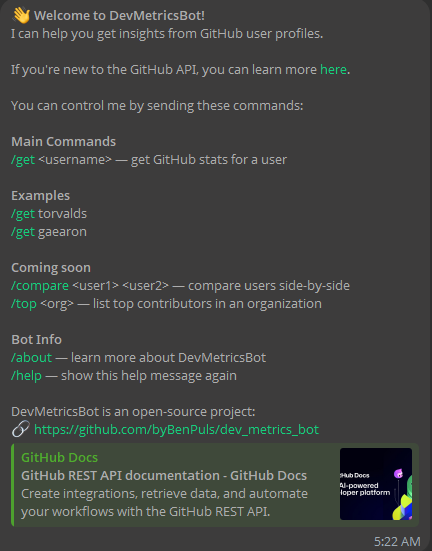
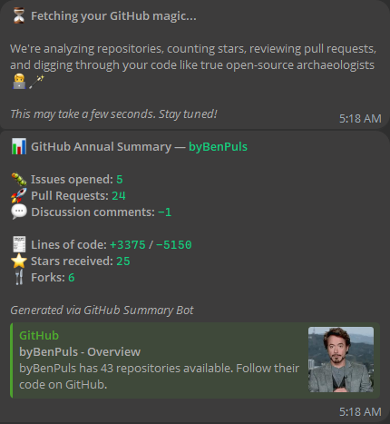

# DevMetricsBot 🤖📊


[](https://github.com/byBenPuls/dev_metrics_bot/actions/workflows/style.yml)
[](https://opensource.org/licenses/MIT)


**DevMetricsBot** is an open-source Telegram bot that helps developers quickly view GitHub profile statistics directly in chat.
Inspired by a simple but powerful idea: 
what if you could summarize your GitHub activity in a single Telegram message?

Many developers have expressed a desire for tools that help them promote their open-source contributions,
impress recruiters, or just track their own progress. DevMetricsBot does exactly that.

---

## ✨ Features

- 📦 `/get <username>` — View GitHub profile stats in one message  
- 📈 Metrics include:
  - Total repositories
  - Stars ★ and forks 🍴
  - Pull requests and issues
  - Lines of code added/removed
  - Discussion participation (in future versions)

- 🔗 Shareable format — copy & forward to chats or channels

- 💡 Compare and leaderboard commands planned

---

## 🧪 Example

🧭 Start command:



📊 Summary result:



---

## 🔧 Tech Stack

- 🐍 Python 3.12
- ⚙️ `aiohttp` — async HTTP and webhook server
- 🔗 Redis — state/cache (optional)
- 🐙 GitHub REST API
- 🔌 DI via `punq`

---

## 🛠 Usage

### 1. Clone & Install

```bash
git clone https://github.com/byBenPuls/dev_metrics_bot
cd dev_metrics_bot

poetry install
```

### 2. Set environment

Create a `.env` or configure via `BaseSettings`:

```
BOT_TOKEN=123456:ABC-DEF1234ghIkl-zyx57W2v1u123ew11
GITHUB_TOKEN=ghp_your_github_token
REDIS_HOST=localhost
REDIS_PORT=6379
REDIS_DB=0
```


### 3. Run

```
poetry run python main.py
```


## 🧩 Contributing

Pull requests welcome! Feature ideas include:

* `/compare user1 user2` — side-by-side stats

* `/top org` — leaderboard by GitHub organization

* WebApp UI for visual insights

* Multilingual support

* Full Redis support

* Rate limits

* Docker

* Tests


## 📖 License

MIT — open for everyone, forever.

## 💬 Contact

Made by @ben_puls

Telegram bot: @DevMetricsBot

GitHub repo: github.com/byBenPuls/dev_metrics_bot
